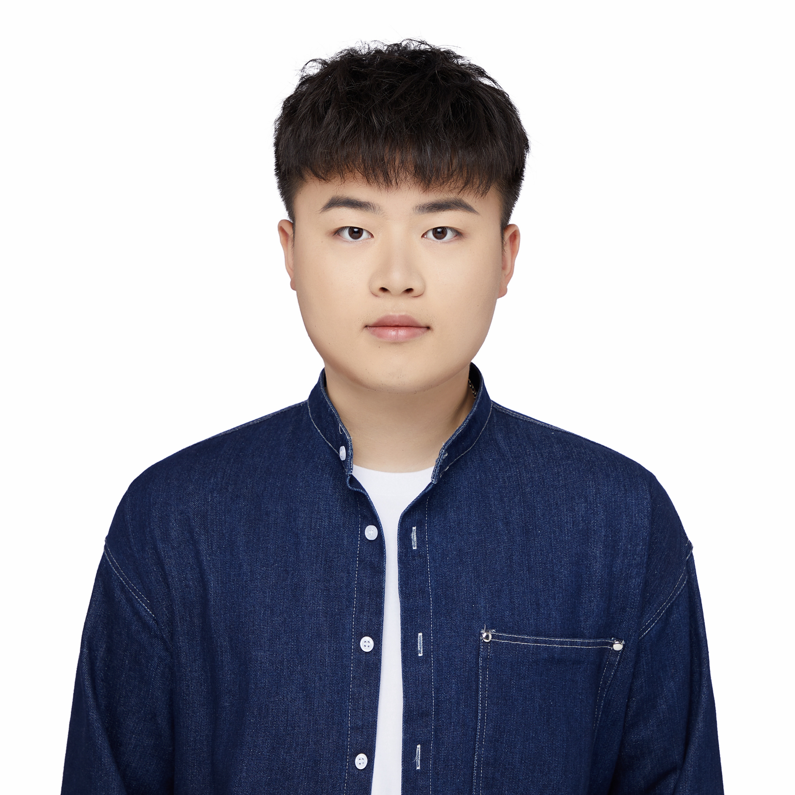

## About me

My name is **Yu Zhou**, and I am a Ph.D. student in **Electrical Engineering** at the **University of Notre Dame**, advised by [Prof. Mengxue Hou](https://engineering.nd.edu/faculty/mengxue-hou/) in the ND ROAR lab. My research lies at the intersection of **robotics**, **computer vision**, and **uncertainty-aware perception**.

Prior to Notre Dame, I earned my **M.S. in Mechanical Engineering and Materials Science** from **Duke University**, and my **B.S. in Mechanical Engineering** from **Florida Institute of Technology**.

---

## Research Interests

My research includes:

- **Computer Vision**
- **Machine/Robot Learning**
- **Marine Robotics**

I work on building robust, interpretable robot perception systems using **3D Gaussian Splatting**. I'm especially interested in applying these techniques in complex domains like underwater environments.

---

## Education

- 🎓 **Ph.D., Electrical Engineering** — University of Notre Dame, 2023–Present  
- 🎓 **M.S., Mechanical Engineering and Materials Science** — Duke University, 2021–2023  
- 🎓 **B.S., Mechanical Engineering** — Florida Institute of Technology, 2017–2021
